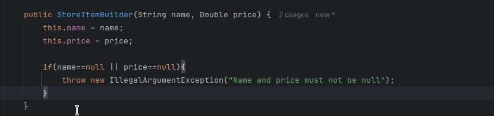
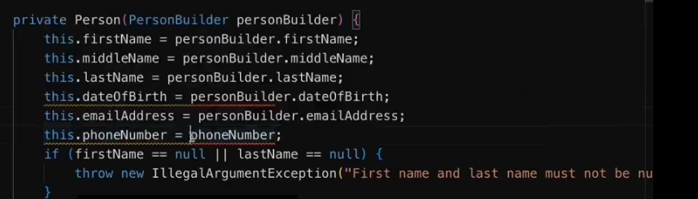
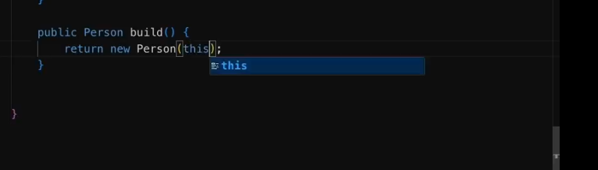

# builder pattern

### create a static class in the target class like this

```

public static class Target {
// fill in the field and follow the remaining steps
}
```
### leave the conmpulsory fields as final
### create a constructor with compulsory fields like this

### create a build method that returns a new Target class with all the required field

### create a Taget-builder method for each optional field like this

``` 
public TargetBuilder optionsfield( OptionClass options1){
this.options1=options1
return this;
}

```
###  repeat it for the remaining optional field 

## final step


replace the pulic constructor of the main class with private, 

replace all the field  Targebuiulder targetbuilder based on te class
similar to this

the last one should gibve you an hint to before nad after



replace all the fields in the build method with this


